# Diagramme MCD - PaieCashPlay Fondation

## 🎯 Schéma Relationnel Visuel

```mermaid
erDiagram
    ZONES_CAF ||--o{ PAYS : contient
    PAYS ||--|| FEDERATIONS : a_une
    FEDERATIONS ||--o{ CLUBS : gere
    CLUBS ||--o{ ENFANTS : accueille
    
    ENFANTS ||--o| LICENCES : peut_avoir
    TYPES_LICENCES ||--o{ LICENCES : definit
    FEDERATIONS ||--o{ LICENCES : emet
    
    USERS ||--o{ DONATIONS : fait
    USERS ||--o{ PARRAINAGES : cree
    ENFANTS ||--o{ PARRAINAGES : beneficie
    PACKS_DONATION ||--o{ PARRAINAGES : utilise
    
    ENFANTS ||--o{ DONATIONS : recoit
    PACKS_DONATION ||--o{ DONATIONS : genere
    
    ENFANTS ||--o{ TEMOIGNAGES : donne
    USERS ||--o{ TEMOIGNAGES : ecrit
    
    ZONES_CAF {
        uuid id PK
        varchar nom
        varchar code
        text description
        timestamp created_at
        timestamp updated_at
    }
    
    PAYS {
        uuid id PK
        varchar nom
        varchar code_iso
        varchar flag_emoji
        text_array langues
        uuid zone_caf_id FK
        timestamp created_at
        timestamp updated_at
    }
    
    FEDERATIONS {
        uuid id PK
        varchar nom
        varchar nom_complet
        uuid pays_id FK
        varchar site_web
        varchar email
        varchar telephone
        text adresse
        varchar president
        timestamp created_at
        timestamp updated_at
    }
    
    CLUBS {
        uuid id PK
        varchar nom
        varchar ville
        text adresse
        uuid federation_id FK
        uuid pays_id FK
        varchar email
        varchar telephone
        varchar president
        varchar entraineur
        date date_creation
        enum statut
        timestamp created_at
        timestamp updated_at
    }
    
    ENFANTS {
        uuid id PK
        varchar nom
        varchar prenom
        varchar nom_complet
        integer age
        date date_naissance
        enum sexe
        varchar position
        varchar photo_emoji
        varchar photo_url
        uuid club_id FK
        uuid pays_id FK
        uuid federation_id FK
        boolean has_license
        enum statut
        text biographie
        text reves_objectifs
        timestamp created_at
        timestamp updated_at
    }
    
    TYPES_LICENCES {
        uuid id PK
        varchar nom
        varchar code
        text description
        decimal prix
        varchar devise
        integer duree_mois
        varchar couleur_badge
        text_array avantages
        boolean actif
        timestamp created_at
        timestamp updated_at
    }
    
    LICENCES {
        uuid id PK
        varchar numero_licence
        uuid enfant_id FK
        uuid type_licence_id FK
        uuid club_id FK
        uuid federation_id FK
        date date_emission
        date date_expiration
        enum statut
        uuid sponsor_id FK
        decimal montant_paye
        varchar devise
        timestamp created_at
        timestamp updated_at
    }
    
    PACKS_DONATION {
        uuid id PK
        varchar nom
        varchar code
        text description
        decimal prix
        varchar devise
        enum type_recurrence
        varchar icone_fa
        varchar couleur_icone
        varchar couleur_fond
        varchar couleur_bouton
        text_array avantages
        boolean actif
        integer ordre_affichage
        timestamp created_at
        timestamp updated_at
    }
    
    USERS {
        uuid id PK
        varchar email
        varchar nom
        varchar prenom
        varchar nom_complet
        varchar telephone
        varchar pays
        varchar ville
        text adresse
        date date_naissance
        enum sexe
        varchar profession
        varchar photo_url
        enum niveau_donateur
        decimal total_dons
        integer nombre_enfants_parraines
        timestamp date_premier_don
        enum statut
        jsonb preferences_communication
        timestamp created_at
        timestamp updated_at
    }
    
    DONATIONS {
        uuid id PK
        uuid user_id FK
        uuid enfant_id FK
        uuid pack_donation_id FK
        decimal montant
        varchar devise
        enum type_don
        enum statut
        enum methode_paiement
        varchar stripe_session_id
        varchar stripe_payment_intent_id
        timestamp date_paiement
        text message_donateur
        boolean anonyme
        boolean recu_fiscal_envoye
        timestamp created_at
        timestamp updated_at
    }
    
    PARRAINAGES {
        uuid id PK
        uuid user_id FK
        uuid enfant_id FK
        uuid pack_donation_id FK
        date date_debut
        date date_fin
        enum statut
        decimal montant_mensuel
        varchar devise
        text message_parrain
        jsonb preferences_communication
        timestamp created_at
        timestamp updated_at
    }
    
    TEMOIGNAGES {
        uuid id PK
        uuid enfant_id FK
        uuid user_id FK
        varchar titre
        text contenu
        enum type
        varchar photo_url
        varchar video_url
        boolean approuve
        boolean affiche_site
        integer note
        timestamp created_at
        timestamp updated_at
    }
```



## 📊 Flux de Données Principaux

### 1. Flux de Donation
```
USER → DONATION → ENFANT
     ↓
PACK_DONATION → PARRAINAGE → LICENCE
```

### 2. Flux Géographique
```
ZONE_CAF → PAYS → FEDERATION → CLUB → ENFANT
```

### 3. Flux de Licence
```
ENFANT + TYPE_LICENCE + FEDERATION → LICENCE
```

## 🔄 Cardinalités Détaillées

| Relation | Cardinalité | Description |
|----------|-------------|-------------|
| ZONES_CAF → PAYS | 1:N | Une zone contient plusieurs pays |
| PAYS → FEDERATIONS | 1:1 | Un pays a une fédération |
| FEDERATIONS → CLUBS | 1:N | Une fédération gère plusieurs clubs |
| CLUBS → ENFANTS | 1:N | Un club accueille plusieurs enfants |
| ENFANTS → LICENCES | 1:0..1 | Un enfant peut avoir une licence |
| USERS → DONATIONS | 1:N | Un utilisateur fait plusieurs dons |
| USERS → PARRAINAGES | 1:N | Un utilisateur peut parrainer plusieurs enfants |
| ENFANTS → PARRAINAGES | 1:N | Un enfant peut avoir plusieurs parrains |

## 🎨 Légende des Couleurs

- **🟢 Vert** : Entités principales (Enfants, Users, Donations)
- **🔵 Bleu** : Entités géographiques (Zones, Pays, Fédérations, Clubs)
- **🟡 Jaune** : Entités de configuration (Types, Packs)
- **🟣 Violet** : Entités de liaison (Licences, Parrainages)
- **🟠 Orange** : Entités support (Témoignages, Contacts, Stats)

## 📈 Évolutivité

### Extensions Futures Possibles
1. **COMPETITIONS** - Gestion des tournois
2. **MATCHS** - Résultats et statistiques
3. **ENTRAINEURS** - Gestion du personnel
4. **PARENTS** - Liaison familiale
5. **SPONSORS_ENTREPRISES** - Partenariats corporates
6. **EVENEMENTS** - Gestion d'événements
7. **FORMATIONS** - Modules d'apprentissage
8. **CERTIFICATIONS** - Diplômes et attestations

### Optimisations Recommandées
1. **Partitioning** sur les tables volumineuses (donations, statistiques)
2. **Archivage** des données anciennes
3. **Cache Redis** pour les statistiques fréquentes
4. **Réplication** en lecture pour les rapports